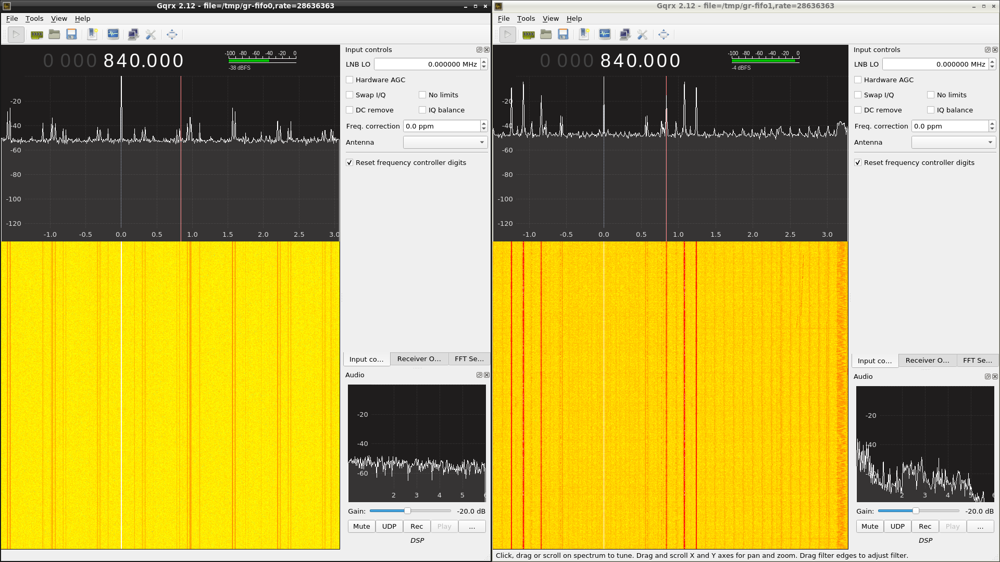

## CX2388x SDR V4L2 Driver for Linux 4.9+

### Loading the SDR module

Blacklist the cx88* modules:

```sh
$ sudo cp ./conf/cx88_sdr.conf /etc/modprobe.d
```

After reboot, under ./src run:

```sh
$ make
$ sudo modprobe videodev
$ sudo insmod cx88_sdr.ko
```

### Using gqrx with 28.636363 MHz, 8-bit (default v4l2 option)

Install gqrx-sdr and qv4l2 then run:

```sh
$ mkfifo /tmp/gr-fifo0
```

Open ./grc/cx88_sdr_8-bit.grc.
With the GNU Radio script running, open gqrx with this device string:

```
file=/tmp/gr-fifo0,rate=28636363
```

Open /dev/swradio0 with qv4l2 and change the input pin so you can connect an antenna.
You will have to modify or remove the LPF from the PCB in order to use the entire frequency range.

Here is a screenshot with 2 gqrx instances running, the one on the right has an antenna connected:


Other gqrx cofigurations:

#### 8-bit - cx88_sdr_8-bit.grc

```
file=/tmp/gr-fifo0,rate=14318182
file=/tmp/gr-fifo0,rate=28636363
file=/tmp/gr-fifo0,rate=35795454
```

#### 16-bit - cx88_sdr_16-bit.grc

```
file=/tmp/gr-fifo0,rate=7159091
file=/tmp/gr-fifo0,rate=14318182
file=/tmp/gr-fifo0,rate=17897727
```

### Unloading the module

```sh
$ sudo rmmod -f cx88_sdr
```
